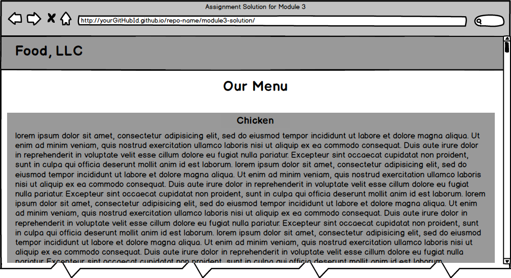
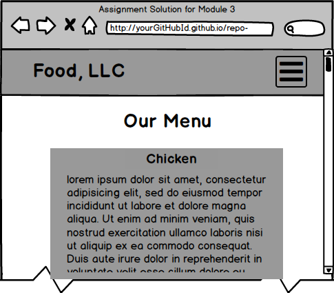
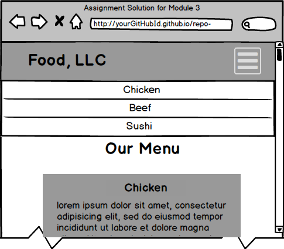
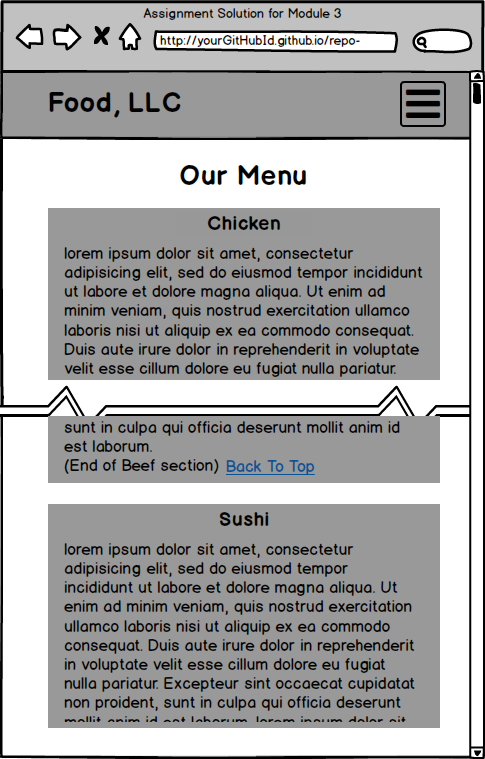
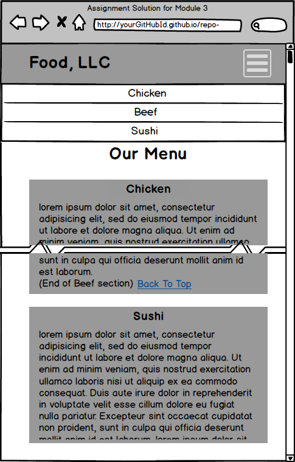

 # Coursera Course:<br>[HTML CSS and Javascript for Web Developers](https://www.coursera.org/learn/html-css-javascript-for-web-developers)<br>
 by [The Johns Hopkins University](https://www.coursera.org/jhu)<br>[](https://www.coursera.org/jhu)<br>


# TABLE OF CONTENT
* [Course Peer-graded Assignments](#Course-Peer-graded-Assignments)
 * [Module 2](#Module-2)
  * [Assignment: Module 2 Coding Assignment](#Module-2-Coding-Assignment)
  * [Solution: Module 2 Solution ](#Solution:Module-2-Solution)
 * [Module 3](#Module-3)
  * [Assignment: Module 3 Coding Assignment](#Assignment:Module-3-Coding-Assignment)
  * [Solution: Module 3 Solution ](#Solution:Module-3-Solution)
 * [Module 4](#Module-4)
  * [Assignment: Module 4 Coding Assignment](#Assignment:Module-4-Coding-Assignment)
  * [Solution: Module 4 Solution ](#Solution:Module-4-Solution)
 * [Module 5](#Module-5)
  * [Assignment: Module 5 Coding Assignment](#Assignment:Module-5-Coding-Assignment)
  * [Solution: Module 5 Solution ](#Solution:Module-5-Solution)
  
> # Course Peer-graded Assignments
>>* solutions to the assignments of the [Course](https://www.coursera.org/learn/html-css-javascript-for-web-developers)


>* # Module 2
>>* ## Assignment:<br> <a href="./assignments/Assignment-2.md" target="_blank">Module 2 Coding Assignment</a>


Woo-hoo! You get to do some coding! Exciting!

**Time to complete:** 1-2 hours. It may take you less time than that if you've absorbed the material in this module well.

**Ask questions in Discussions if you get stuck! We are all learning, and going through getting stuck and then unstuck (even with someone's help) can be a very valuable learning experience!**

**Don't get scared by the number of points below. It's really not so much. I just wanted to explain everything as clearly as I could and break it down into smaller steps.**

Here is what you will need to complete the assignment:

1. (If you haven't already) Create a GitHub.com account and a repository that you will use for this class.

2. (If you haven't already) Follow the Development Setup Video (beginning of Module 1) instructions on how to create a repository and set it up such that you can host and view your finished web pages on GitHub Pages, i.e., GitHub.io domain name. You will need to provide that URL for your peer review.

3. Create a folder in your repository that will serve as a container folder for your solution to this assignment. You can call it whatever you want. For example, `module2-solution` or `mod2_solution`, etc. Create an `index.html` file inside the solution container folder, e.g., `module2-solution/index.html`.

4. The implementation of the page you will be creating should follow the mockup illustrations shown below. You are provided 3 mockups: desktop, tablet, and mobile. Your implementation has to be JUST 1 page, NOT 3 pages. In other words, you will be creating a single, responsive page.

5. Your page must include a CSS file. No inline styles allowed. Your CSS file should be placed into a `css` folder under the solution container folder, e.g., `module2-solution/css`.

6. You are NOT allowed to use any CSS (or Javascript) framework for this assignment, including Twitter Bootstrap CSS Framework. No framework CSS files should even be referenced in your index.html, even if you are not using them. **However, you MAY use the simple responsive framework we developed in Lecture 24 as a starting point for this assignment.**

7. You must implement the following breakpoints that will be considered desktop, tablet, and mobile. The browser should display a desktop version of the site when the width of the browser window is 992px and above. Tablet view should appear only if the width of the browser window is between 768px and 991px, inclusively. Mobile view should appear only if the width of the browser is equal to or less than 767px.

8. Your site is very simple. It consists of a page heading and 3 sections (all in one row in the desktop view). Each section contains some text. You can make it dummy text/"lorem ipsum", it doesn't matter. How the sections are laid out on the screen depends on the width of the browser window. (_Hint: use media queries discussed in Lecture 23._)

9. Layout: In the desktop view (992px and above), each of the 3 sections should take up equal amount of space on the screen. As you make the browser window wider or narrower, each section should become wider or narrower. (_Hint: use percentages to define width and use the 'float' property. See Lecture 24_). For a visual reference of this view, see the desktop mockup illustration below.

10. Layout: In the tablet view (between 768px and 991px, inclusively), the first 2 sections should be in the first row and be of equal size. The 3rd section should be in the second row and take up the entire row by itself. For a visual reference of this view, see the tablet mockup illustration below.

11. Layout: In the mobile view (equal to or less than 767px), each section should take up the entire row. For a visual reference of this view, see the mobile mockup illustration below.

12. Section title region: Each section should have a section title region that is always positioned at the top right corner of the section no matter the view (desktop, tablet or mobile). Copy the titles from the mockup illustration (i.e., Chicken, Beef, Sushi) or come up with your own. (_Hint: use relative and absolute positioning and offsets as discussed in Lecture 22._)

13. Spacing: Pay attention to the spacing shown in the mockup illustrations. Note the spacing between sections (both horizontal and vertical). Note the horizontal spacing between the edges of the section and the edges of the browser window. Also, note the spacing between the dummy text in each section and the edges of the section. Lastly, make sure the dummy text is "pushed down" enough so it doesn't overlap the section title region. (_Hint: use margins and padding and use border-box as your box-sizing as discussed in Lecture 19._)

14. Borders and Colors: Each section should have a background color set to some color (of your choosing). Set the background color of each section title region to some unique color (of your choosing). Make sure that the background color still allows the user to view the text in the section and section title regions. Depending on the color you choose, you may want to change the color of the text so it can be easy to read. Set a black border on both the section and section title region that is 1px thick. **Warning: While not specifying borders and colors according to the requirements does not hurt your grade so much, not doing so will make it much harder for your classmates to peer grade the rest of your assignment, possibly resulting in a much lower grade.**

15. (OPTIONAL) _You will NOT be graded on this_, but you may want to explicitly set a font-family for the text in your page, so you are not stuck with the default browser font family. Also, set the font size of the heading and section title to be 75% larger and 25% larger (respectively) than the font size of the dummy text.

Here is the mockup illustration of the desktop version of the site. Your final result should look very close to this mockup.

 

Here is the mockup illustration of the tablet version of the site. Your final result should look very close to this mockup. Note that in this view, the 3rd section takes up the entire row.

 

Here is the mockup illustration of the mobile version of the site. Your final result should look very close to this mockup.

 


>>* ## Solution:<br> <a href="./Week2Module2Solution/" target="_blank">Module 2 Solution</a>
>>>* ## [Source](./Week2Module2Solution/)
>>>* ## [WebPage](https://mohamedelfal.github.io/Coursera-course-HTML-CSS-and-Javascript-for-Web-Developers/Week2Module2Solution/index.html)
 <br> 
  
  
  
>* # Module 3
>>* ## Assignment:<br><a href="./assignments/Assignment-3/Assignment-3.md" target="_blank"> Module 3 Coding Assignment </a>

Woo-hoo! MORE CODING!!! Exciting! :-)

**Time to complete:** About 1 hour or less.

**Ask questions in Discussions if you get stuck! We are all learning, and going through getting stuck and then unstuck (even with someone's help) can be a very valuable learning experience!**

**Don't get scared by the number of points below.**  **Most of it is NOT graded and is optional for you to try on your own.**

Here is what you will need to complete the assignment:

1. (If you haven't already) Create a GitHub.com account and a repository that you will use for this class.

2. (If you haven't already) Follow the Development Setup Video (beginning of Module 1) instructions on how to create a repository and set it up such that you can host and view your finished web pages on GitHub Pages, i.e., GitHub.io domain name. You will need to provide that URL for your peer review.

3. Create a folder in your repository that will serve as a container folder for your solution to this assignment. You can call it whatever you want. For example, `module3-solution` or `mod3_solution`, etc. Create an `index.html` file inside the solution container folder, e.g., `module3-solution/index.html`.

4. The implementation of the page you will be creating should follow the mockup illustrations shown below. You are provided 3 mockups: desktop and tablet (same), mobile, and mobile with mobile menu dropdown shown. Your implementation has to be JUST 1 page. In other words, you will be creating a single, responsive page.

5. Your page must include a CSS file. No inline styles allowed. Your CSS file should be placed into a `css` folder under the solution container folder, e.g., `module3-solution/css`.

6. For this assignment, you are to use Twitter Bootstrap CSS Framework as much as possible. I suggest you start with copying the starter bootstrap files and folders we discussed in Lecture 25 part 2. If you've cloned/downloaded the code example repository, it should be in the `examples/Lecture25` folder. Copy the contents of `examples/Lecture25` to your solution container folder (e.g., `module3-solution`) as a starting point..

7. Since we are using Bootstrap for this assignment, instead of specifying pixel ranges, I will define our desktop, tablet, and mobile views in terms of Bootstrap CSS class prefixes, i.e., `md`, `sm`, and `xs`.
  * Desktop mockup illustration should correspond to Bootstrap `md`-based classes
  * Tablet mockup illustration should correspond to Bootstrap `sm`-based classes
  * Mobile mockup illustration should correspond to Bootstrap `xs`-based classes

8. Navbar: Create a navbar that scrolls away together with the page (the navbar should become invisible and is not fixed to the top when you scroll the page down). The navbar should have a company name (i.e., `navbar-brand` class) called "Food, LLC" that is aligned to the left side of the navbar. (*See* [https://getbootstrap.com/docs/3.3/components/#navbar](https://getbootstrap.com/docs/3.3/components/#navbar). *Make the browser window narrower to see the mobile menu button appear in the first example shown at the provided link.*)
<br><br>
For desktop and tablet view, the navbar should not contain anything else. No other buttons should be visible. (_Hint: use 'visible-xs' class._)

9. Navbar - Mobile View: Create a simple menu button (3 horizontal bars). When the user clicks that button, a dropdown menu should appear (as illustrated in Mobile Open Menu illustration below.) The dropdown menu should contain 3 items: Chicken, Beef, and Sushi.
<br><br>
The dropdown menu should take up the entire width of the browser window. Make sure the dropdown menu has a background color set that distinguishes it from the rest of the content.
<br><br>
(_Hint: See_ [_https://getbootstrap.com/docs/3.3/components/#navbar_](https://getbootstrap.com/docs/3.3/components/#navbar) _and Lecture 31 for examples on how to accomplish this._)

10.  Page Heading. The page heading that says Our Menu should be centered within the browser window. You must use a Bootstrap class to accomplish this.
<br><br>
(_Hint: look for a Bootstrap class that centers text, see_ [_https://getbootstrap.com/docs/3.3/css/#type-alignment_](https://getbootstrap.com/docs/3.3/css/#type-alignment)_._)

11.  Create a single really tall section that will use the Bootstrap Grid and take up the entire width of the browser window (minus some margins, of course) for all views: desktop, tablet, and mobile. To make the section really tall, you can either fill it out with a LOT of text or simply set its height to something like 1000px. It needs to be tall enough to cause scrolling down to be required to view the bottom of the section. Make sure its background color is set to distinguish it from the rest of the content. (_Hint: don't forget to have an element with a class='container' or class='container-fluid' wrapping your grid. Remember that to have the grid do something "always", i.e., no matter what browser window size, use the `col-xs-`... classes. In this case, since we want the section to take up the entire row, use `col-xs-12`._)


Both the tablet view and the desktop view of what's graded and required is the same. Here is the mockup illustration of the desktop & tablet version of the site (only required graded parts shown):

 


Here is the mockup illustration of the mobile view (only required graded parts are shown):

 

 


**&#42;&#42;&#42; REQUIRED GRADED ASSIGNMENT ENDS HERE &#42;&#42;&#42;**  
<br>
<br>
<br>
<br>
**OPTIONAL, UNGRADED PORTION IS BELOW:**

**The rest of this assignment is not graded and is optional, but it's good practice, so go for it if you have time. The solution to the optional ungraded portion of the assignment below does NOT have to be submitted.**

1. (OPTIONAL, NOT GRADED) Since in this optional part you will be implementing something more complex than a single section in the Bootstrap grid, remove that section before continuing.

2. (OPTIONAL, NOT GRADED) As in previous assignment, the rest of your site is very simple. It consists of a page heading and 3 sections (all in one row in the desktop view). Each section contains some text. You can make it dummy text/"lorem ipsum", it doesn't matter. How the sections are laid out on the screen depends on the width of the browser window. (_Hint: use the Bootstrap Grid we discussed in Lecture 26 of Module 2 as well as numerous lectures of Module 3, including Lecture 35._)

3. (OPTIONAL, NOT GRADED) Each section should be fairly large in height. You can achieve this by either filling it up with a lot of content text or simply setting its height property to something large like 700px. At the end of each section, provide a link that says "Back to Top". This link should jump the page back to "Our Menu" heading. (_Hint: use a link that points to a section of the page discussed in Lecture 9 of Module 1._)

4. (OPTIONAL, NOT GRADED) Each section should have an h3-based section heading which should be centered within the section. Use the same Bootstrap class you used for centering the page heading to center the section heading. Use the heading names shown in the mockup illustrations, i.e., "Chicken", "Beef", "Sushi".

5. (OPTIONAL, NOT GRADED)Layout: In the desktop view, each of the 3 sections should take up equal amount of space on the screen. As you make the browser window wider or narrower, each section should become wider or narrower.
<br><br>
(_Hint: use `md`-based grid column classes as discussed in Lecture 26 and Lecture 35 among others. It's a 12 grid-based system, so 3 in a row means each grid will take up 4 grid cells, i.e., `col-md-4`._)
For a visual reference of this view, see the desktop mockup illustration below.

6.  (OPTIONAL, NOT GRADED)Layout: In the tablet view, the first 2 sections should be in the first row and be of equal size. The 3rd section should be in the second row and take up the entire row by itself.
<br><br>
(_Hint: use 'sm'-based grid column classes and remember that you don't really need to define a separate 'row' class as you can achieve this layout within a single Bootstrap 'row' as discussed in Lecture 26 and Lecture 35, among others. To have 2 sections take up an entire row, i.e., all 12 columns, each one should take up 6 columns. To make the 3rd section take up the entire width of the browser window, i.e., 12 columns, use `col-sm-12`._)
<br><br>
For a visual reference of this view, see the tablet mockup illustration below.

7.  (OPTIONAL, NOT GRADED)Layout: In the mobile view, each section should take up the entire row.
<br><br>
(_Hint: use `xs`-based grid column class. Since you need to take up the entire row, use `col-xs-12`._)
<br><br>
For a visual reference of this view, see the mobile mockup illustration below.

8.  (OPTIONAL, NOT GRADED) Link the menu items "Chicken", "Beef", "Sushi" from the mobile-only menu drop down to jump to the part of the page those sections correspond to.


**MOCKUP ILLUSTRATIONS ARE BELOW:**

**Please NOTE: these mockup illustrations show parts that are optional and not graded for this assignment. Please refer to the requirements above to confirm what parts of the mockup are required and graded and what parts are optional.**

Here is the mockup illustration of the desktop version of the site: 

Here is the mockup illustration of the tablet version of the site:   


Here is the mockup illustration of the mobile version of the site with the menu dropdown NOT open (on the left) and menu drop down open (on the right):





>>* ## Solution:<br> <a href="./week-3-module-3-solution/" target="_blank"> Module 3 Solution </a>
>>>* ## [Source](./week-3-module-3-solution/)
>>>* ## [WebPage](https://mohamedelfal.github.io/Coursera-course-HTML-CSS-and-Javascript-for-Web-Developers/week-3-module-3-solution/index.html)
<br>


>* # Module 4
>>* ## Assignment:<br><a href="././assignments/Assignment-4/Assignment-4.md" target="_blank"> Module 4 Coding Assignment </a>
       
**Let's write a little bit of Javascript programming code to practice what we've learned!
Woohoo! :-)**

**Time to complete:** About 30 minutes.

**Ask questions in Discussions if you get stuck! We are all learning, and going through getting stuck and then unstuck (even with someone's help) can be a very valuable learning experience!**

**Summary:** In this assignment, you are going to loop over an array of names and print out either a `hello` or `goodbye` to that name to the browser console. If the name starts with a letter `j` or `J`, you are to print out `Goodbye JSomeName`. If the name starts with any other letter, you are to print out `Hello SomeName`.

However, in order to do that printing you will have to use 2 externally provided libraries whose code is not 100% ready to be used. Using the things we've learned in this module, your job will be to fix the code in those libraries.

You will get some starter code to work with where all the steps of what you need to do are clearly spelled out for you.

Here is what you will need to do in order to complete the assignment:

1. (If you haven't already) Create a GitHub.com account and a repository that you will use for this class.

2. (If you haven't already) Follow the Development Setup Video (beginning of Module 1) instructions on how to create a repository and set it up such that you can host and view your finished web pages on GitHub Pages, i.e., GitHub.io domain name. You will need to provide that URL for your peer review.

3. Create a folder in your repository that will serve as a container folder for your solution to this assignment. You can call it whatever you want. For example, `module4-solution` or `mod4_solution`, etc.

4. You will need to download the starter files for this project and copy them into your solution container folder (e.g., into `module4-solution`). Since assignments and starter code get updated from time to time, don't assume that you have the latest version already on your system. The best way to ensure that you are working with the very latest starter code is either `git clone` the `fullstack-course4` repository into a new directory OR, if you've already done 'git clone' previously, you can simply open up your command prompt (cmd on Windows or Terminal on Mac), navigate to the folder where the `fullstack-course4` repository was previously cloned into and do: `git pull`.
<br><br>
This will update your local copy of the repository with whatever changes have been made since the last update.
<br><br>
**As a reminder, the full repository URL is:
https://github.com/jhu-ep-coursera/fullstack-course4**

5. Once the local repository on your system is up to date, **YOU HAVE A CHOICE**!
If you want a _slightly_ more challenging assignment, use the code in the "harder" folder as your starting point. If you want a _slightly_ less challenging assignment, use the code in the "easier" folder as your starting point. The _difference_ between the two starting points is that in the "easier" starting point, there are a few steps that are already completed for you.
  * **Harder**: If you want a _slightly_ more challenging assignment, copy all the contents of the `fullstack-course4/assignments/assignment4/assignment4-solution-starter/harder` folder into your newly created solutions container folder for this assignment, e.g., 'module4-solution'.

  * **Easier**: If you want a _slightly_ less challenging assignment, copy all the contents of the `fullstack-course4/assignments/assignment4/assignment4-solution-starter/easier` folder into your newly created solutions container folder for this assignment, e.g., 'module4-solution'.
  <br><br>
  **NOTE: the provided starter code will not run. It is up to you to follow the instructions to get it to run.** Once you've copied the starter code of your choice into your solution folder, open up your solution folder in the code editor. **Open up `script.js` file and follow the steps.**

6. When you are continuously working on the assignment, use Browser Sync and keep Chrome open to the Console tab of the Chrome Developer Tools. You will likely see errors there to start with. Follow the steps outlined in the starter code and those errors should go away by the time you finish the last step. If you still see errors at that point or you are not seeing the output you're supposed to see, you probably made a mistake somewhere, so look into that and investigate.
<br><br>
Remember, if you are stuck, ask questions on the course Discussion forum.

7. That's it!


>>* ## Solution:<br> <a href="./week-4-module-4-solution/" target="_blank">Module 4 Solution</a>
>>>* ## [Source](./week-4-module-4-solution/)
>>>* ## [WebPage](https://mohamedelfal.github.io/Coursera-course-HTML-CSS-and-Javascript-for-Web-Developers/week-4-module-4-solution/index.html)
<br>

>* # Module 5
>>* ## Assignment:<br> <a href="./assignments/Assignment-5/Assignment-5.md" target="_blank"> Module 5 Coding Assignment </a>


Last assignment and you are DONE!

**Time to complete:** About 30 minutes.

**Ask questions in Discussions if you get stuck! We are all learning, and going through getting stuck and then unstuck (even with someone's help) can be a very valuable learning experience!**

**Summary:** In this assignment, we are going to have a bit of fun with our built restaurant web application. The front page of our web app contains 3 clickable tiles: Menu, Specials, and Map. If you click on the Specials tile, you will be taken to a single category page where all the menu items that belong to the Specials menu category will be shown. Your task in this assignment is to alter this behavior such that when the user clicks on the Specials tile, the web app takes the user to a random single category menu page, listing menu items in the category, be it "Lunch", "Dinner", "Sushi", etc. That way, any random category can become the Specials! What fun! (not! :-) )

In order to accomplish this, we need to change the home HTML snippet and, besides pulling it dynamically from the server, also insert a random category `short_name` into the function call of the following code. Previously, the code to send the user to the "Specials" category was this:

```html
<a href="#" onclick="$dc.loadMenuItems('SP');">
```

For this assignment, we changed this line to prepare it for a random category `short_name` to be this:

```html
<a href="#" onclick="$dc.loadMenuItems({{randomCategoryShortName}});">
```

Here is what you will need to complete the assignment:

1. (If you haven't already) Create a GitHub.com account and a repository that you will use for this class.

2. (If you haven't already) Follow the Development Setup Video (beginning of Module 1) instructions on how to create a repository and set it up such that you can host and view your finished web pages on GitHub Pages, i.e., GitHub.io domain name. You will need to provide that URL for your peer review.

3. Create a folder in your repository that will serve as a container folder for your solution to this assignment. You can call it whatever you want. For example, `module5-solution` or `mod5_solution`, etc.

4. You will need to download the starter files for this project and copy them into your solution container folder (e.g., into 'module5-solution'). Since assignments and starter code get updated from time to time, don't assume that you have the latest version already on your system. The best way to ensure that you are working with the very latest starter code is either 'git clone' the `fullstack-course4` repository into a new directory OR, if you've already done 'git clone' previously, you can simply open up your command prompt (cmd on Windows or Terminal on Mac), navigate to the folder where the `fullstack-course4` repository was previously cloned into and do: `git pull`
<br><br>
This will update your local repository with whatever changes have been made since the last update.
<br><br>
**As a reminder, the full repository URL is:
https://github.com/jhu-ep-coursera/fullstack-course4**

5. Once you update your repository, copy all the contents of the `fullstack-course4/assignments/assignment5/assignment5-solution-starter` folder into your newly created solutions container folder for this assignment, e.g., `module5-solution`.
<br><br>
Once that's done, you are ready to start coding the solution.
<br><br>
**NOTE: the provided code will not run. It is up to you to follow the instructions to get it to run.**

6. You are NOT allowed to change the `home-snippet.html` file. Any adjustments to the value of `randomCategoryShortName` property needs to be done in Javascript code.

7. There are 4-5 fairly simple steps to implement the required functionality.
  * Open up `js/script.js` file.
  * Find TODO: STEP 0, and follow the instructions until you are done with TODO: STEP 4.
<br><br>
If you've watched the lectures, the code should be very familiar to you.<br><br>

8. Once you are done, verify that the desired functionality is working correctly. Use Browser Sync or deploy your solution to GitHub pages.
  * Load the home page in the browser.
  * Click on the Specials tile. A single page category with a list of menu items for **some** category should appear.
  * Click on the restaurant logo to go back to the home page.
  * Click on the Specials tile again. Most likely, a different single page category page will be shown.
<br><br>
Repeat this several times to make sure that most of the time you see a different single category page.
<br><br>

9. That's it!


>>* ## Solution:<br> <a href="./week-5-module5-solution/" target="_blank">Module 5 Solution</a>
>>>* ## [Source](./week-5-module5-solution/)
>>>* ## [WebPage](https://mohamedelfal.github.io/Coursera-course-HTML-CSS-and-Javascript-for-Web-Developers/week-5-module5-solution/index.html)
